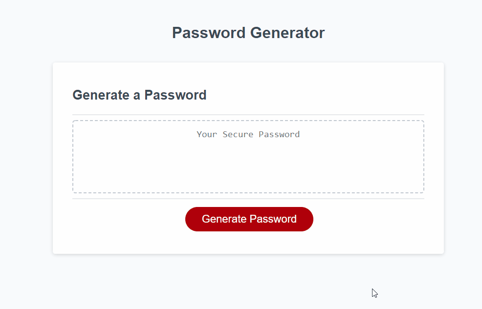

	

Table of Contents:

- [Password Generator](#password-generator)
	- [Demo](#demo)
	- [The algorithm](#the-algorithm)
	- [Possible improvements](#possible-improvements)

# Password Generator

The third assignment for the Rutgers Coding Bootcamp, building a secure password generator.

Given the frontend, we needed to output a string of characters to the DOM, conforming to restrictions provided by the user.

## Demo

## The algorithm

-  The user is asked a series of questions, via alert dialog

   1. How many characters? (between 8 and 128)
   2. Use special characters?
   3. Use uppercase letters?
   4. Lowercase?
   5. Use numbers?

-  Based on each answer, the respective set of characters is appended to a string pool
-  A random character is pulled from the "pool" `n` times, conforming to user request
-  The resulting string, in-effect a secure password, is written to the DOM.

## Possible improvements

This is the simplest way I could think of without consulting Dr. Google, but if you know a better way of going about this, reach out or submit a pull request 👍
